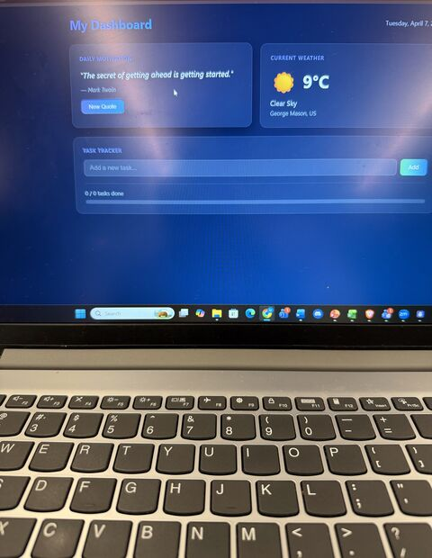
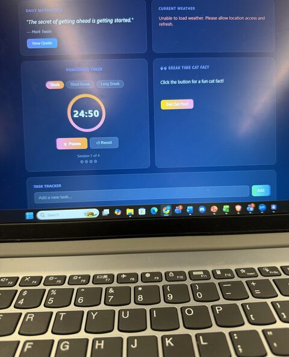

# Productivity Dashboard with Amazon Kiro

Built at an AWS workshop (hosted with GMU NSBE and GMU ColorStack) using Amazon Kiro, an AI-assisted development environment.

## What it does

- Pomodoro timer with work, short break, and long break modes
- Task tracker
- Daily motivational quote
- Break-time cat fact button
- Real-time weather integration

## Takeaways

- Describing what you want in plain language ("vibe coding") can turn an idea into a working app quickly, but you still need to understand the logic to build and secure it properly.
- Integrating an API like weather makes an application instantly more practical.
- Understanding how these systems are built matters just as much when thinking about their security.

## Tools

Amazon Kiro, AWS
