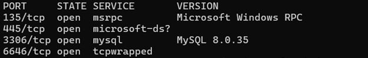
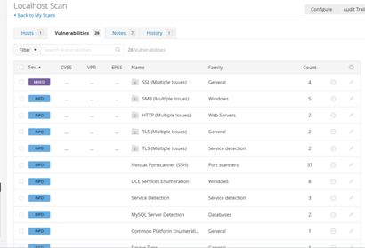

# Vulnerability Assessment Labs

Hands-on vulnerability scanning and risk analysis, done on my own machine and in Hack The Box Academy labs.

## Lab 1: Scanning my own system (Nmap and Nessus)

I ran a full scan of my own machine, reviewed the open ports, and went through the findings.

What I took away:

- Open ports such as SMB and RPC can be real entry points if they are not secured.
- Even "low severity" and informational findings show how much information a system gives away.
- Attackers only need one weak spot, and vulnerabilities are not always obvious.

I also read up on real-world vulnerabilities, including Log4Shell and SMB exploits, to understand how these issues are used in attacks.

## Lab 2: Two scanners on a Windows target (Hack The Box Academy)

I scanned a Windows target with both Nessus (running on Windows) and OpenVAS (running on Ubuntu). Each tool picked up findings the other missed, which is a good reminder that relying on one scanner in a real engagement can leave gaps.

While reviewing the results I found an unpatched CVE that could have gone unnoticed without a careful read. I then wrote a full report covering severity ratings, CVSS scores, and remediation recommendations.

## Tools

Nmap, Nessus, OpenVAS, Hack The Box Academy

## Note

Both labs were run only against my own machine or an authorized lab target.
